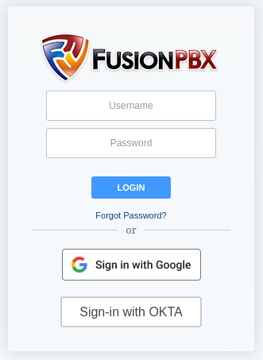
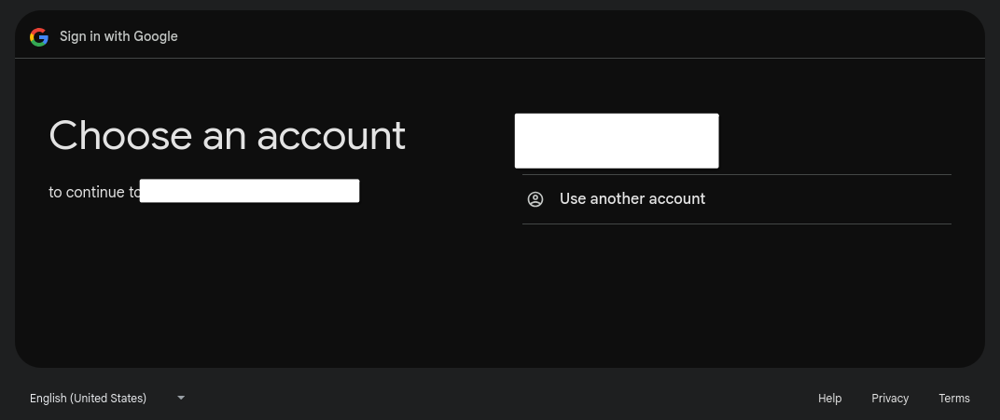
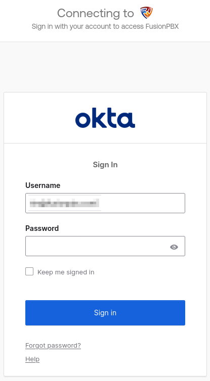

# FusionPBX  OpenID Connect Authentication App

---

## What is OIDC?

The OpenID Connect protocol allows using an OpenID Connect provider such as okta, Google, or others to use your username and password authentication from that provider as a means to log in to the FusionPBX Web front-end.
This means the password in the database is not relevant for the log in process.

---

## Requirements

The OpenID Connect Authentication app **requires FusionPBX version 5.4.2 or higher**.

---

## Install and Configuration

#### Debian/Ubuntu Install

Using the root account, run the following command:

```sh
cd /var/www/fusionpbx \
  && git clone https://github.com/fusionpbx/fusionpbx-app-open_id.git app/open_id \
  && php core/upgrade/upgrade.php \
  && chown www-data:www-data -R /var/www/fusionpbx
```

The command above will download the open_id app into the *app/open_id* directory using git.

Change the */var/www/fusionpbx* to match the folder of your installation should it be in a different location.

#### Other Operating Systems

Adjust the Debian install commands to match the path and web user for your system.

---
### Configuration

Once the install is complete, set the values in the global default settings under the Open ID category.

The configuration options are as follows:

#### All Plugins Configuration
Each option listed below is universal for all authenticator modules.
- **enabled** *boolean* - Enables/Disables the OpenID Connect application module. This can be used to quickly enable/disable the module without toggling any other option.
- **methods** *array* - Sets the open_id modules to use for authentication. Each method will have a class associated with this module located in the `open_id/resources/classes` directory. Available modules can be enabled or disabled for authentication.
- **suppress_errors** *boolean* - Enable/Disables the display of errors. This can be helpful for debugging the plugin as extra checks are made to help ensure proper configuration.

#### Google Plugin Configuration
- **google_client_id** *text* - Set the client id to be used from the `https://console.cloud.google.com` project resource.
- **google_client_secret** *text* - Set the client secret to be used from the `https://console.cloud.google.com` project resource.
- **google_redirect_uri** *text* - Defaults to `https://{$domain_name}/app/open_id/open_id.php?action={$plugin}`. This is a dynamic setting where the values for `{$domain_name}` and `{$plugin}` are replaced with the domain name that is used to connect to your FusionPBX instance. For example, if you normally connect to your server using the URL of `https://fusionpbx.example.com/login.php` and are using the google plugin, the `domain_name` would automatically be replaced with `fusionpbx.example.com` and the resulting in a redirect URL of https://fusionpbx.example.com/open_id/open_id.php?action= The redirect URI in the https://console.cloud.google.com project resource must match this value.
- **google_metadata_domain** *text* - Defaults to the `accounts.google.com` authentication server for discovery.
- **google_metadata_path** *text* - Defaults to the `/.well-known/openid-configuration` path for discovery.
- **google_username_mapping** *text* - Defaults to `email=user_email`. The left-hand part (before equals) is the OpenID Connect field. The right-hand part (after equals) is the local database column the user field should map to. This is used to map the fields provided by Google after authentication with the OpenID Connect Authentication Server. The Google `user` field contains the email address associated with the account.

#### OKTA Plugin Configuration
- **okta_client_id** *text* - Set the client id to be used from the `https://dev-9999999.okta.com` project resource.
- **okta_client_secret** *text* - Set the client secret to be used from the `https://dev-9999999.okta.com` project resource.
- **okta_redirect_uri** *text* - Defaults to `https://{$domain_name}/app/open_id/open_id.php?action={$plugin}`. This is a dynamic setting where the values for `{$domain_name}` and `{$plugin}` are replaced with the domain name that is used to connect to your FusionPBX instance. For example, if you normally connect to your server using the URL of `https://fusionpbx.example.com/login.php` and are using the google plugin, the `domain_name` would automatically be replaced with `fusionpbx.example.com` and the resulting in a redirect URL of https://fusionpbx.example.com/open_id/open_id.php?action= The redirect URI in the https://console.cloud.google.com project resource must match this value.
- **okta_metadata_domain** *text* - The value for your okta domain. For example, `dev-9999999.okta.com`.
- **okta_metadata_server** *text* - Defaults to `default`. The okta_metadata_domain and okta_metadata_server are combined to create the discovery URI.
- **okta_username_mapping** *text* - Defaults to `username=user_email`. The left-hand part (before equals) is the OpenID Connect field. The right-hand part (after equals) is the local database column the user field should map to. This is used to map the fields provided by OKTA after authentication with the OpenID Connect Authentication Server. The OKTA `username` field contains the email address associated with the account.

#### Notes:

User email address must be unique when using the default mapping. The column used in the mapping must not have two records that match. If two accounts have the same email address, the authentication would not know which user to map to. To ensure unique user names for login, enable the Global Default Setting *Unique* in the *Users* category with a *value* of `global`. Then, set the `okta_username_mapping` to have a value of `username=username` and the `google_username_mapping` to have a value of `email=username`. This means the user login screen can use an email address as the user login as well as the OpenID Connect Authentication.

The "Logout" menu option in FusionPBX does not logout of OKTA or any OIDC service that requires a callback to remove the active token.

The OpenID Connect app has been tested with Google and OKTA Developer Edition successfully.

---

## Screenshots

When Google and OKTA are enabled, the login screen will be shown as follows:



Choosing Google will show:



Choosing OKTA will show:


